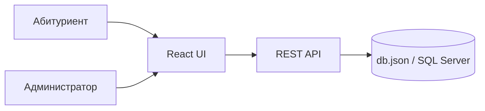
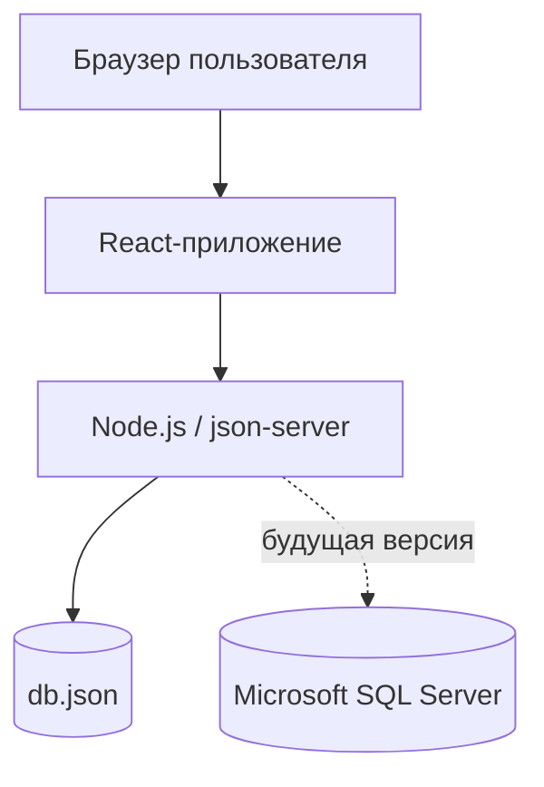

**Автор страницы:** Кублик Ольга

## Логическая архитектура

Система состоит из клиентской части, API-слоя и слоя данных. В текущем MVP API имитируется через `json-server`, а данные хранятся в `db.json`.

## Декомпозиция функций

| Функция | Элемент архитектуры |
| --- | --- |
| Просмотр программ | React-компоненты, GET /programs |
| Фильтрация программ | состояние UI, query-параметры API |
| Карточка программы | React-страница, GET /programs/:id |
| Управление программами | админ-панель, POST/PUT/DELETE |
| Документация API | OpenAPI YAML |
| Хранение данных | db.json, SQL Server модель |

## Проектные критерии

- простота разработки и поддержки;
- разделение интерфейса и данных;
- возможность будущего подключения backend;
- читаемость кода;
- адаптивность интерфейса;
- расширяемость API.

## Требования, выполняемые операторами

Администратор отвечает за актуальность данных. Приемная комиссия проверяет соответствие информации официальным условиям поступления. Абитуриент выполняет поиск и выбор программы самостоятельно через интерфейс.

## Готовые элементы и повторное использование

В проекте используются готовые технологии:

- React;
- Vite;
- json-server;
- Leaflet;
- Docusaurus;
- Microsoft SQL Server.

## Альтернативные решения

| Решение | Плюсы | Минусы |
| --- | --- | --- |
| json-server | быстро для MVP | нет полноценной авторизации |
| Express + SQL Server | реалистичная серверная часть | больше времени на разработку |
| Vercel/Render | быстрый деплой | сложнее хранить SQL Server |
| VDS Ubuntu | полный контроль | требует настройки сервера |

## Интерфейсы

- пользовательский интерфейс: React-страницы;
- программный интерфейс: REST API;
- интерфейс данных: SQL-таблицы и `db.json`;
- интерфейс администратора: формы создания и редактирования программ.

## Физическая архитектура

## Учет архитектурных решений

Архитектурные решения фиксируются в документации, спецификации API и SQL-скриптах. Это позволяет отслеживать связь между требованиями, интерфейсами и реализацией.
