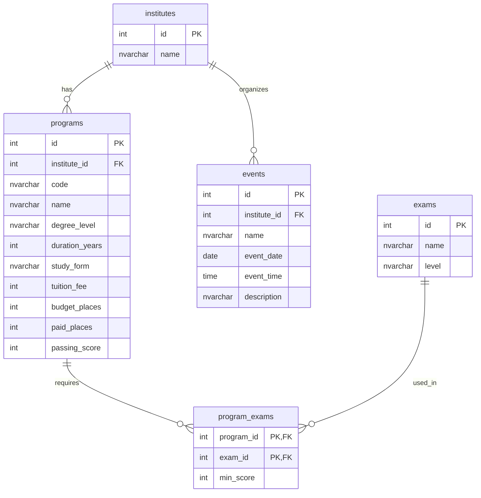

**Автор страницы:** Лещевич Варвара

## Назначение базы данных

База данных предназначена для хранения информации о программах, институтах, экзаменах, минимальных баллах и мероприятиях.

## Основные сущности

| Сущность | Назначение |
| --- | --- |
| `institutes` | институты и факультеты |
| `programs` | образовательные программы |
| `exams` | экзамены |
| `program_exams` | связь программ и экзаменов |
| `events` | мероприятия |

## ER-диаграмма



## SQL Server

Для курсовой базы данных выбрана Microsoft SQL Server. Она поддерживает внешние ключи, ограничения целостности, индексы и язык SQL.

## Индексы

```sql
CREATE INDEX IX_programs_institute_id ON programs(institute_id);
CREATE INDEX IX_programs_passing_score ON programs(passing_score);
CREATE INDEX IX_programs_study_form ON programs(study_form);
CREATE INDEX IX_program_exams_exam_id ON program_exams(exam_id);
```
