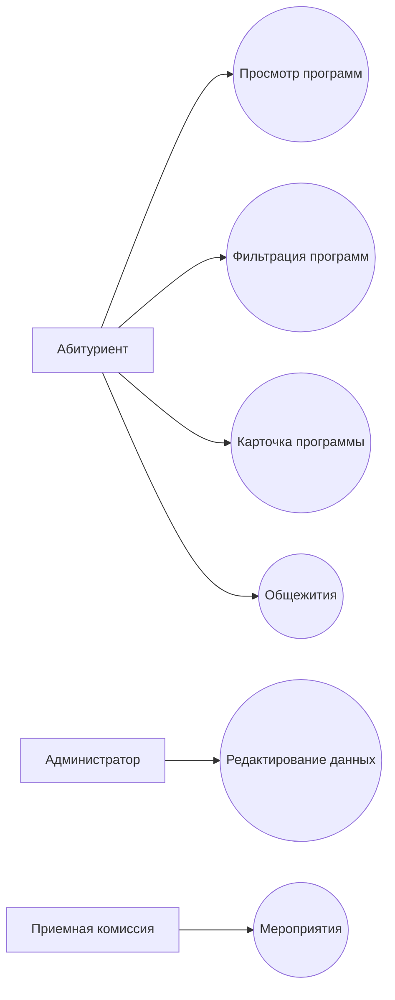
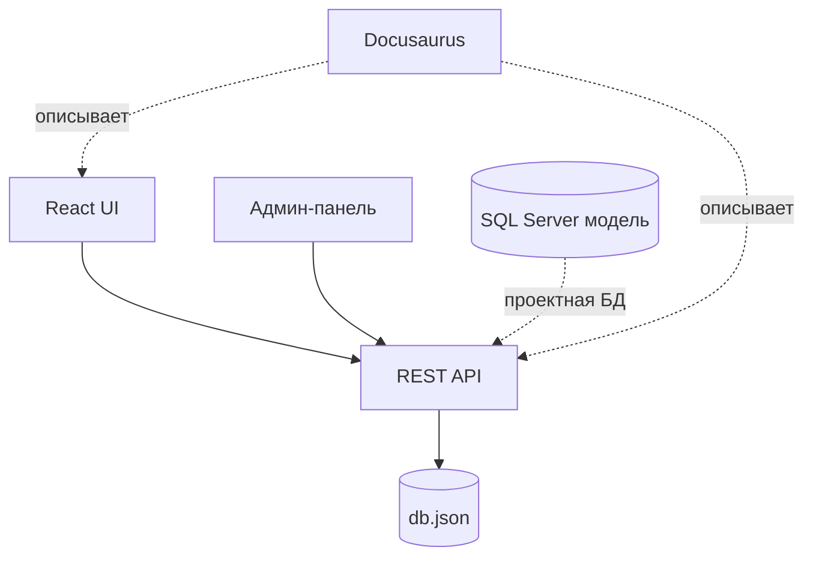
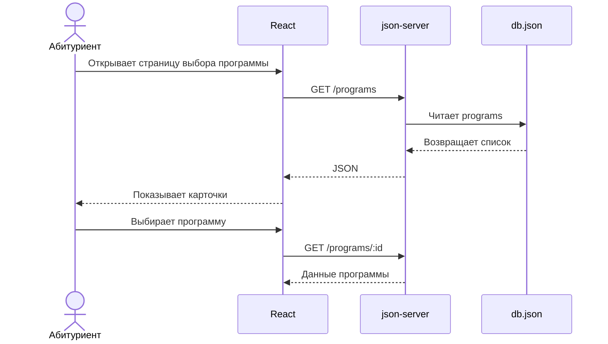

**Автор страницы:** Нистор Анна

## Диаграмма вариантов использования

## Диаграмма компонентов

## Диаграмма последовательности выбора программы

## Загруженная ER-диаграмма

## Приложения

- OpenAPI-спецификация: [openapi.yaml](pathname:///files/openapi.yaml)
- SQL-скрипты находятся в папке `sqlserver` основного проекта.
- Проверочные запросы API находятся в `api/console-tests.md`.
