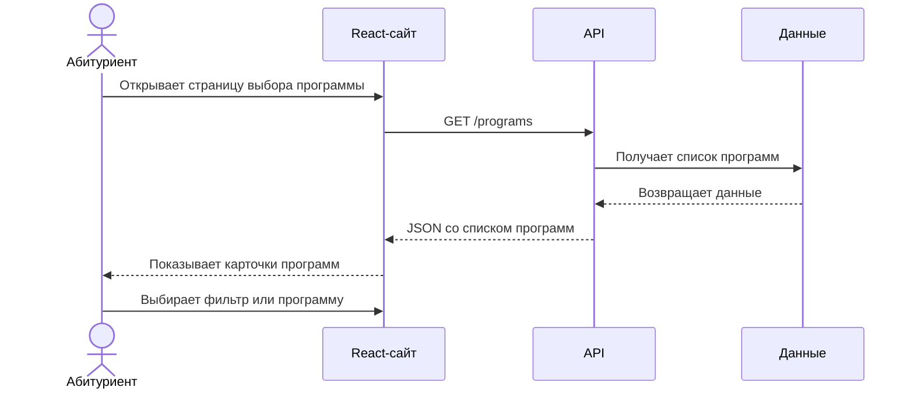

**Автор страницы:** Нистор Анна

## Цель процесса определения требований

Цель процесса — выявить требования к системе, которые обеспечивают функциональные возможности, необходимые пользователям и заинтересованным лицам.

## Классы пользователей

| Пользователь | Интерес к системе |
| --- | --- |
| Абитуриент | выбрать программу и узнать условия поступления |
| Родитель абитуриента | оценить стоимость, общежитие и перспективы |
| Администратор | обновлять программы и данные сайта |
| Приемная комиссия | информировать поступающих |
| Руководитель проекта | контролировать выполнение требований |

## Требования пользователей

### Абитуриент

- просматривать список программ;
- фильтровать программы по форме обучения и экзаменам;
- сортировать программы по проходному баллу;
- открывать подробную карточку программы;
- видеть стоимость, бюджетные и платные места;
- узнавать информацию об общежитиях и мероприятиях.

### Администратор

- добавлять образовательные программы;
- редактировать программы;
- удалять устаревшие записи;
- обновлять стоимость, места и проходные баллы;
- работать через понятную админ-панель.

### Приемная комиссия

- проверять корректность опубликованных данных;
- готовить сведения для консультаций;
- размещать мероприятия и справочную информацию.

## Ограничения системных решений

- данные MVP хранятся в `db.json`;
- полноценная авторизация пока не реализована;
- React не подключается напрямую к SQL Server;
- будущая интеграция с базой должна идти через серверный API;
- интерфейс должен быть понятен пользователю без обучения.

## Последовательные действия пользователя

## Взаимодействие пользователя и системы

Пользователь взаимодействует с системой через веб-интерфейс. Основные элементы взаимодействия: навигация, фильтры, карточки программ, кнопки подачи документов и административные формы.

## Требования безопасности

- административные функции должны быть защищены авторизацией;
- пользовательские данные не должны храниться без необходимости;
- API должен проверять входные данные;
- ошибки должны выводиться без технических деталей сервера.

## Документирование требований

Требования фиксируются в Docusaurus-документации, Word-файлах курсовой работы и спецификации API.
